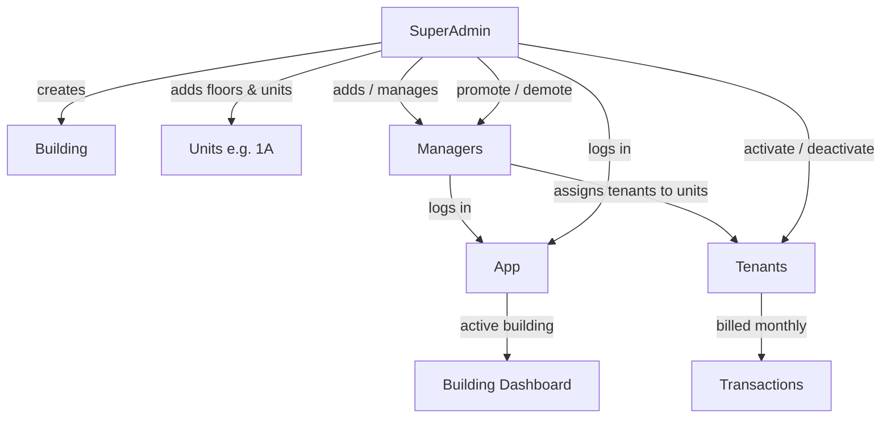

# 00 — Overview

## Problem statement

A building-wise tenant management application. An organization manages one or more
buildings. Each building has floors and units (e.g. `1A`). Tenants occupy units and
are billed month-wise. Staff (Managers) log in to manage tenants and transactions;
a SuperAdmin oversees everything.

## Goals

- **Simple** to build and operate.
- **Solid security** — role-based access, hashed passwords, validated inputs.
- Accurate **history**: when a unit changes tenant, the previous tenant's records
  (especially transactions) remain intact and attributable.
- **Month-wise** financial tracking per tenant.

## Actors

| Actor             | Logs in?             | Purpose                                                                           |
| ----------------- | -------------------- | --------------------------------------------------------------------------------- |
| SuperAdmin        | Yes                  | Full control: buildings, floors, units, tenants, managers, role changes           |
| Manager (= Admin) | Yes                  | Runs day-to-day finance: tenants, months, payments, income, expenses, withdrawals |
| Tenant            | No (unless promoted) | A record occupying a unit; can be promoted to Manager                             |

## In scope

- Multi-building support with a per-user **active building**.
- Building → floors → units hierarchy, with **configurable units per floor**.
- Tenant lifecycle: add, activate/deactivate, reassign unit, promote/demote.
- **Monthly cash book**: opening balance, service charges, dues, tenant payments,
  other income (rooftop rent/electricity, charity), expenses (with vouchers),
  withdrawals, and closing cash in hand — with preserved history.
- Authentication + RBAC for SuperAdmin and Manager.

## Out of scope (for now)

- Tenant self-service login/portal (tenants don't log in unless promoted).
- Online payments / payment gateway integration.
- Notifications (email/SMS).
- Reporting/analytics dashboards beyond basic building dashboard.

## High-level flow

