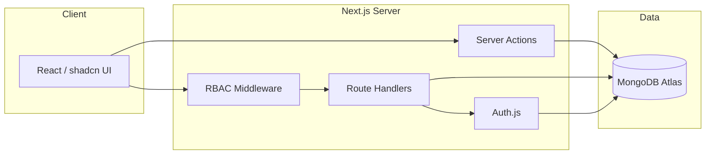

# 01 — Tech Stack

One full-stack Next.js project (no separate backend service).

| Layer                | Choice                                                                 | Why                                                 |
| -------------------- | ---------------------------------------------------------------------- | --------------------------------------------------- |
| **Framework**        | Next.js (App Router) + TypeScript                                      | Server + client in one project; type-safe           |
| **UI**               | Tailwind CSS + shadcn/ui                                               | Clean, accessible components, minimal setup         |
| **API**              | Next.js Route Handlers + Server Actions                                | No separate API server to maintain                  |
| **Database**         | MongoDB                                                                | Document model fits flexible tenant/unit data       |
| **ODM**              | Mongoose                                                               | Schemas, validation, indexes, populate for refs     |
| **Auth**             | Auth.js (NextAuth v5) — Credentials provider                           | JWT sessions, integrates with Next.js               |
| **Password hashing** | bcrypt                                                                 | Industry standard, salted hashing                   |
| **Validation**       | Zod                                                                    | Validates all input; guards against NoSQL injection |
| **Hardening**        | RBAC middleware, rate limiting, secure cookies, CSRF, security headers | Defense in depth                                    |

## Notes / decisions

- **MongoDB Atlas (free tier)** recommended for hosting — it runs a replica set, which
  enables multi-document transactions needed for the unit-reassignment flow.
- **Mongoose over Prisma** for MongoDB: idiomatic ODM, flexible schema, `populate` for
  references, and no replica-set requirement for basic operations.
- **Auth.js Credentials + JWT** (not database sessions) keeps auth stateless and simple.

## Environment variables

```
MONGODB_URI=mongodb+srv://...        # Atlas connection string
AUTH_SECRET=<random 32+ byte secret> # Auth.js JWT signing
AUTH_URL=http://localhost:3000       # base URL
```

## Architecture


