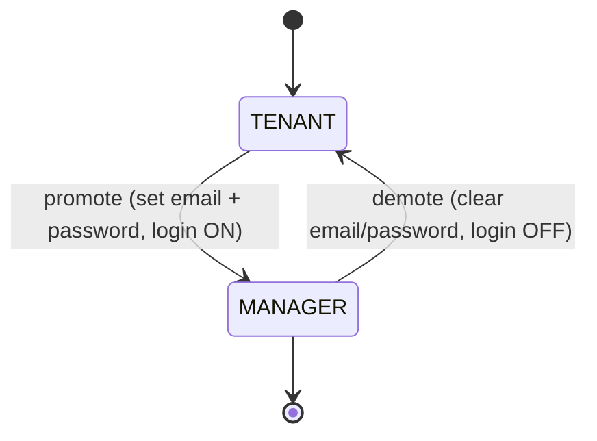

# 02 — Roles & RBAC

A single `role` field on the `User` document drives all access control.

## Roles

| Role                | Login | Capabilities                                                                                                 |
| ------------------- | ----- | ------------------------------------------------------------------------------------------------------------ |
| `SUPER_ADMIN`       | Yes   | Everything: create buildings/floors/units, add tenants, manage managers, promote/demote, activate/deactivate |
| `MANAGER` (= Admin) | Yes   | Manage tenants + transactions within building(s) they can access                                             |
| `TENANT`            | No\*  | A record occupying a unit. \*Can log in only after being promoted to `MANAGER`.                              |

## Permission matrix

| Action                              | SUPER_ADMIN | MANAGER | TENANT |
| ----------------------------------- | :---------: | :-----: | :----: |
| Log in                              |     ✅      |   ✅    |   ❌   |
| Create / edit / delete Building     |     ✅      |   ❌    |   ❌   |
| Configure floors & units            |     ✅      |   ❌    |   ❌   |
| Create Manager                      |     ✅      |   ❌    |   ❌   |
| Edit / delete Manager               |     ✅      |   ❌    |   ❌   |
| Promote Tenant → Manager            |     ✅      |   ❌    |   ❌   |
| Demote Manager → Tenant             |     ✅      |   ❌    |   ❌   |
| Add tenant to unit                  |     ✅      |   ✅    |   ❌   |
| Activate / deactivate tenant        |     ✅      |   ❌    |   ❌   |
| Reassign unit to new tenant         |     ✅      |   ✅    |   ❌   |
| Open / close a month                |     ✅      |   ✅    |   ❌   |
| Record tenant payments              |     ✅      |   ✅    |   ❌   |
| Record income (rooftop, charity…)   |     ✅      |   ✅    |   ❌   |
| Record expenses (with voucher)      |     ✅      |   ✅    |   ❌   |
| Record withdrawals                  |     ✅      |   ✅    |   ❌   |
| Manage recurring expense payables   |     ✅      |   ✅    |   ❌   |
| View building dashboard / cash book |     ✅      |   ✅    |   ❌   |

> Note: SuperAdmin owns structural/identity actions (buildings, units, managers,
> roles, activation). Managers run day-to-day finance: months, payments, income,
> expenses, and withdrawals. Adjust during build if needed.

## Promote / demote flow (SuperAdmin only)

- **Promote** `TENANT → MANAGER`: SuperAdmin sets an `email` and initial password;
  `passwordHash` is stored and login is enabled.
- **Demote** `MANAGER → TENANT`: `email`/`passwordHash` cleared; login disabled.
  The person's tenant record and transaction history remain intact.

## Enforcement

- **Middleware** guards protected routes and rejects unauthenticated requests.
- **Server-side role checks** on every mutating action (never trust the client).
- **JWT** carries `userId` and `role`; re-checked against the DB for sensitive actions.
