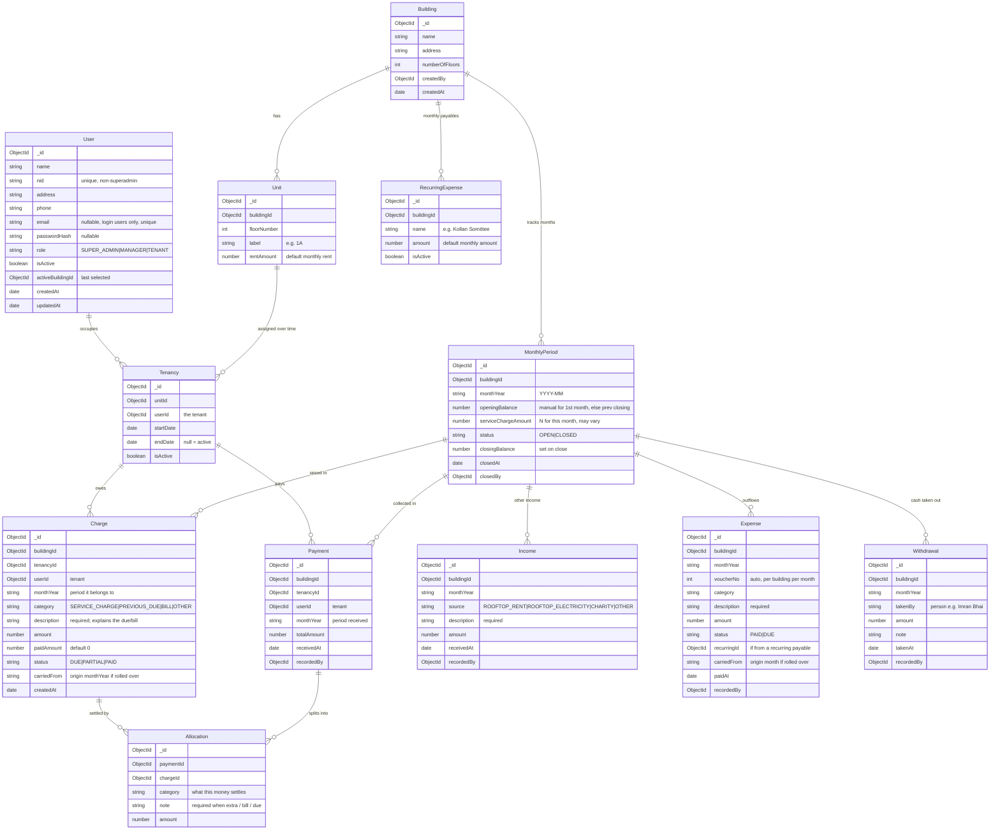

# 03 — Data Model (MongoDB / Mongoose)

## Entity-relationship diagram

## Collections

### `users`

- Login users (`SUPER_ADMIN`, `MANAGER`) require `email` + `passwordHash`.
- Tenants have `name`, `nid`, `address`, `phone` and **no** login credentials.
- `activeBuildingId` remembers the last building the user selected.

### `buildings`

- Created by SuperAdmin. Floors and the **number/labels of units per floor are
  configurable** (this building = 2 units/floor: `A`, `B`). `numberOfFloors` plus the
  unit config drive `units` creation.

### `units`

- Belongs to a building; identified by `floorNumber` + `label` (custom, e.g. `A1`,
  `B1`).
- Optional `rentAmount` as the default monthly charge.

### `tenancies`

- Links a **tenant (`userId`)** to a **`unit`** for a time span.
- Active tenancy: `endDate = null`, `isActive = true`.
- Ending a tenancy sets `endDate` and `isActive = false` — the row is never deleted.

### `monthlyperiods`

- One document per **building per month** (`monthYear` = `YYYY-MM`).
- `openingBalance` = **manual input** for the very first month, otherwise the previous
  month's `closingBalance` (cash in hand carried forward).
- `serviceChargeAmount` is the service charge `N` for that month and **may vary** month
  to month.
- `status`: `OPEN` (accepting entries) or `CLOSED` (finalized).
- `closingBalance` is computed and frozen when the month is closed.
- See [04 — Scenarios](./04-scenarios.md) and [07 — Monthly Ledger](./07-monthly-ledger.md).

### `charges` (what a tenant owes)

- Replaces the old simple `transactions` model with an explicit **ledger of dues**.
- Belongs to a **tenancy** (history follows the tenant even after reassignment).
- `category`:
  - `SERVICE_CHARGE` — the current month's service charge.
  - `PREVIOUS_DUE` — a due carried in at tenant creation, or an unpaid service charge
    rolled forward on month close.
  - `BILL` — a separate bill (e.g. utility, repair share).
  - `OTHER` — anything else.
- `description` is **required** and must explain the charge (e.g. _"Unpaid service
  charge for 2026-01"_, _"Water bill"_).
- `paidAmount` tracks partial settlement; `status` is derived: `DUE` (0 paid),
  `PARTIAL` (some paid), `PAID` (fully settled).

### `payments` (money received from a tenant)

- Records cash received from a tenant in a given month.
- `totalAmount` must equal the sum of its **allocations**.
- Each **allocation** links part of the payment to a specific `Charge`, so any amount
  beyond the current service charge is explicitly categorized (paying a due or a bill).
- Allocations may be embedded in the payment document (Mongoose subdocuments).

### `incomes` (non-tenant money)

- Sources: `ROOFTOP_RENT`, `ROOFTOP_ELECTRICITY`, `CHARITY`, `OTHER`.
- `description` is **required**; contributes to the month's closing balance.

### `expenses` (outflows)

- Cash paid out during the month (Gas, cleaning, bills, repairs, welfare, etc.).
- `voucherNo` is **auto-generated sequential per building per month**.
- `status`: `PAID` (reduces cash) or `DUE` (a payable carried forward — e.g. an unpaid
  recurring payable). `recurringId` links to its `RecurringExpense` template.

### `withdrawals` (cash taken out)

- Money removed from the cash box by a person (e.g. owner). `takenBy`, `amount`, `note`.
- Reduces cash in hand but is **not** an operating expense.

### `recurringexpenses` (monthly payable templates)

- Named payables that must be paid every month (e.g. `Kollan Somittee`).
- Each month an `Expense` is raised from the template; if unpaid it stays `DUE`.

## Indexes

| Collection     | Index                                                  | Purpose                                  |
| -------------- | ------------------------------------------------------ | ---------------------------------------- |
| users          | `{ email: 1 }` unique (sparse)                         | One login per email                      |
| users          | `{ nid: 1 }` unique (sparse)                           | No duplicate national IDs                |
| units          | `{ buildingId: 1, label: 1 }` unique                   | No duplicate unit label in a building    |
| tenancies      | `{ unitId: 1, isActive: 1 }`                           | Fast "current occupant" lookup           |
| tenancies      | `{ userId: 1 }`                                        | A tenant's history                       |
| monthlyperiods | `{ buildingId: 1, monthYear: 1 }` unique               | One period per building per month        |
| charges        | `{ tenancyId: 1, monthYear: 1, category: 1 }` unique   | One service charge per month per tenancy |
| charges        | `{ tenancyId: 1, status: 1 }`                          | Fast outstanding-due lookup              |
| payments       | `{ tenancyId: 1, monthYear: 1 }`                       | A tenant's payments in a month           |
| incomes        | `{ buildingId: 1, monthYear: 1 }`                      | Month's other income                     |
| expenses       | `{ buildingId: 1, monthYear: 1, voucherNo: 1 }` unique | Sequential vouchers                      |
| withdrawals    | `{ buildingId: 1, monthYear: 1 }`                      | Month's withdrawals                      |

## Constraints & rules

- A `Unit` may have **at most one** active `Tenancy` at a time.
- Deleting is avoided for tenancies, charges, and payments — the ledger is append-only.
- A `Payment.totalAmount` **must equal** the sum of its allocations.
- Every `Charge`, `Income`, and `Expense` **must** carry a non-empty `description`.
- `Expense.voucherNo` is unique and sequential within a building+month.
- Only `PAID` expenses and `Withdrawal`s reduce cash in hand; `DUE` expenses do not.
- A month cannot be re-opened once `CLOSED`; corrections are new entries.
- `SUPER_ADMIN` records skip the tenant-only fields (`nid`, `address`, `phone`).
