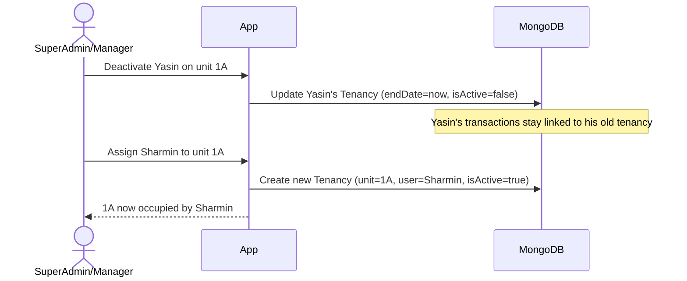
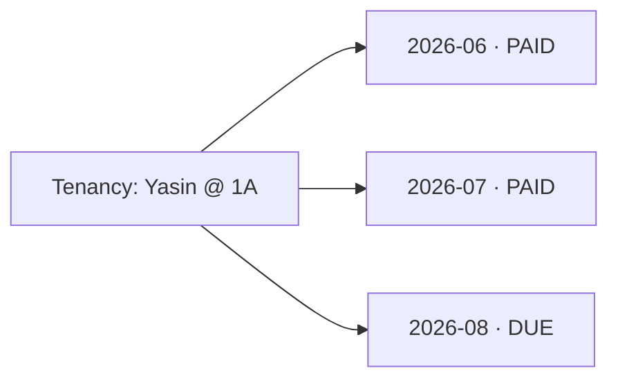
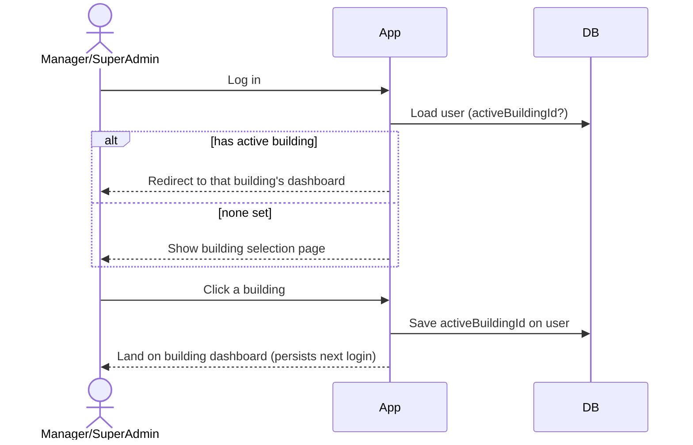

# 04 — Key Scenarios

## 1. Reassign a unit to a new tenant

Example: Yasin occupies unit `1A`. He is deactivated and `1A` is reassigned to Sharmin.
Yasin's transaction history must remain intact.

- The old `Tenancy` is closed, not deleted.
- A new `Tenancy` is created for the same `Unit`.
- All of Yasin's `Transaction` documents remain attached to his closed tenancy.

## 2. Month-wise transactions

- Each month raises a `SERVICE_CHARGE` `Charge` per active tenant; `Payment`s settle it.
- Unpaid charges roll forward as dues; history stays attached to the tenant's tenancy.
- Full opening-balance / service-charge / dues / payments / month-close flow is
  documented in [07 — Monthly Ledger](./07-monthly-ledger.md).

## 3. Active building selection

- On building click, `activeBuildingId` is saved on the user (and mirrored in an
  httpOnly cookie for fast reads).
- The user always lands on that building's dashboard until they actively switch.

## 4. Promote / demote (SuperAdmin only)

- **Promote** `TENANT → MANAGER`: set `email` + initial password → login enabled.
- **Demote** `MANAGER → TENANT`: clear `email`/`passwordHash` → login disabled;
  tenant record and history preserved.
