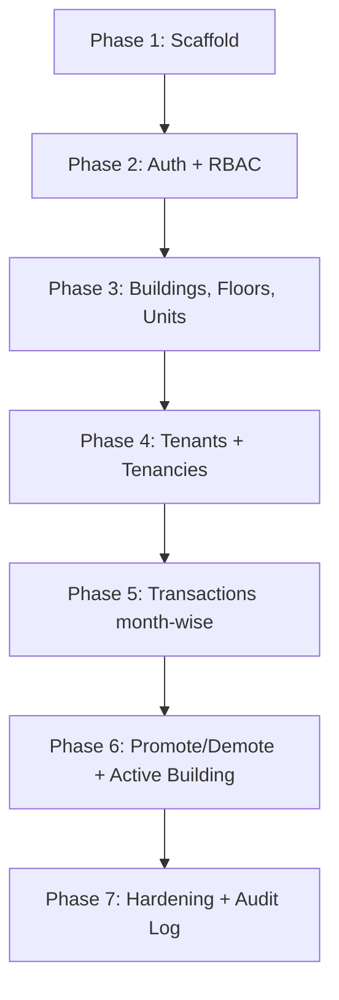

# 06 — Project Structure & Build Phases

## Proposed folder layout

```
tenant-app/
├─ src/
│  ├─ app/
│  │  ├─ (auth)/
│  │  │  └─ login/                # login page
│  │  ├─ (dashboard)/
│  │  │  ├─ buildings/            # building selection
│  │  │  └─ [buildingId]/
│  │  │     ├─ page.tsx           # building dashboard
│  │  │     ├─ units/             # floors & units
│  │  │     ├─ tenants/           # tenant management
│  │  │     └─ transactions/      # month-wise transactions
│  │  ├─ admin/
│  │  │  └─ managers/             # SuperAdmin: manage/promote/demote
│  │  └─ api/                     # route handlers (auth, webhooks)
│  ├─ components/                 # shadcn/ui + shared components
│  ├─ lib/
│  │  ├─ db.ts                    # Mongoose connection (cached)
│  │  ├─ auth.ts                  # Auth.js config
│  │  ├─ rbac.ts                  # role guards
│  │  └─ validators/              # Zod schemas
│  ├─ models/                     # Mongoose schemas
│  │  ├─ User.ts
│  │  ├─ Building.ts
│  │  ├─ Unit.ts
│  │  ├─ Tenancy.ts
│  │  └─ Transaction.ts
│  ├─ server/                     # server actions & services
│  └─ middleware.ts               # route protection
├─ .env                           # MONGODB_URI, AUTH_SECRET, AUTH_URL
├─ .env.example
├─ package.json
└─ tsconfig.json
```

## Build phases



1. **Scaffold** — Next.js + TS, Tailwind, shadcn/ui, Mongoose connection, base layout.
2. **Auth + RBAC** — Auth.js credentials, bcrypt, middleware, seed a SuperAdmin.
3. **Buildings/Floors/Units** — SuperAdmin CRUD, unit generation from floor count.
4. **Tenants + Tenancies** — add tenants, assign to units, activate/deactivate, reassign.
5. **Transactions** — month-wise records per tenancy, PAID/DUE status.
6. **Promote/Demote + Active Building** — role transitions, active-building persistence.
7. **Hardening** — rate limiting, headers, CSRF, audit log, tests.

## Seed data (dev)

- One `SUPER_ADMIN` account created via a seed script (credentials from `.env`).
