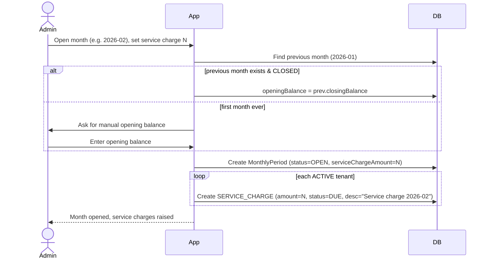
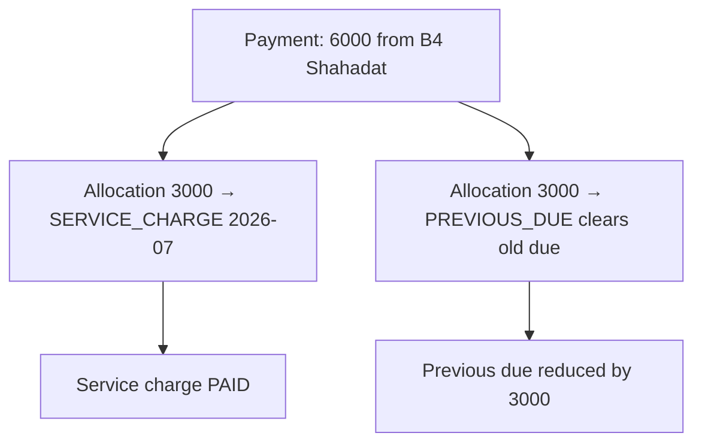

# 07 — Monthly Ledger & Finance

This document captures the real-life monthly accounting flow: opening a month,
service charges, dues, payments (including overpayments), other income, and closing a
month. Money is tracked **building-wise** and **month-wise** (January → December).

## Core concepts

| Concept               | Meaning                                                                                                                          |
| --------------------- | -------------------------------------------------------------------------------------------------------------------------------- |
| **Monthly Period**    | A building's ledger for one month (`YYYY-MM`), `OPEN` or `CLOSED`.                                                               |
| **Opening Balance**   | Cash in hand carried from the previous month. **Manual** for the first month; afterwards = previous month's closing balance.     |
| **Service Charge**    | Amount `N` every **active** tenant must pay for the current month. May vary month to month.                                      |
| **Charge**            | Anything a tenant owes: a service charge, a previous due, or a bill. Always has a **description**.                               |
| **Payment**           | Money received from a tenant, split (allocated) across the charges it settles.                                                   |
| **Income**            | Non-tenant money: rooftop rent, rooftop electricity, charity, other.                                                             |
| **Expense**           | Cash paid out (Gas, bills, cleaning, repairs…), each with an auto voucher no.                                                    |
| **Recurring payable** | A monthly expense that must be paid every month (e.g. Kollan Somittee); if unpaid it becomes an **expense due** carried forward. |
| **Withdrawal**        | Money taken out of cash by a person (e.g. owner). Reduces cash in hand; not an operating expense.                                |
| **Closing Balance**   | Cash in hand at month end; becomes next month's opening balance.                                                                 |

## Balance formula

```
closingBalance (cash in hand) =
      openingBalance
    + Σ(tenant payments received this month)
    + Σ(other income this month)      # rooftop rent, rooftop electricity, charity…
    - Σ(expenses PAID this month)     # unpaid expense-dues do NOT reduce cash
    - Σ(withdrawals this month)       # money taken out by owner/person
```

- `openingBalance(month N) = closingBalance(month N-1)`
- First month's `openingBalance` is entered manually.

## Opening a month



- Opening a month **raises a `SERVICE_CHARGE` for every active tenant** at the month's
  amount `N`.
- Deactivated tenants are skipped (they don't owe the current month).

## Tenant dues

- A tenant's **outstanding due** = sum of unpaid/partially paid `Charge`s:
  ```
  tenantDue = Σ(charge.amount − charge.paidAmount)   where status ≠ PAID
  ```
- **Every due must explain itself** via `description` + `category`:
  - `SERVICE_CHARGE` — the month's service charge.
  - `PREVIOUS_DUE` — added manually when creating the tenant, or an unpaid service
    charge rolled forward at month close.
  - `BILL` — a separate bill (utility, repair share, etc.).
- **On tenant creation**, admin can add one or more `PREVIOUS_DUE` charges, each with an
  amount and a required explanation.

## Paying (and overpaying)

A payment is split into **allocations**. Any amount beyond the current service charge
**must** be assigned to a specific charge (a due or a bill) — the UI forces the user to
say _what the extra money is for_.



Rules:

- `Σ(allocations) == payment.totalAmount`.
- Each allocation updates the target charge's `paidAmount` and recomputes its `status`
  (`DUE` → `PARTIAL` → `PAID`).
- **Underpayment** is allowed: a partial allocation leaves the charge `PARTIAL`; the
  remainder stays as due.
- **Overpayment** relative to the service charge is only possible by allocating the
  extra to a real `BILL`/`PREVIOUS_DUE` — no unexplained money.

## Other income (non-tenant)

- Recorded as `Income` entries against the month, each with a **required description**
  and a `source`:
  - `ROOFTOP_RENT` — e.g. "Advance Roof" rent for the rooftop room.
  - `ROOFTOP_ELECTRICITY` — electricity charge collected from the rooftop.
  - `CHARITY` — social/charity donations.
  - `OTHER` — anything else.
- They increase the month's collection and therefore the closing balance.

## Expenses & vouchers

- Every expense is an `Expense` entry with a **required description**, an `amount`, and
  an **auto-generated voucher number** (`V.No`) sequential per building per month.
- Examples from the real cash book: Gas, Wheel Jharu, Harpic Brush, Beton + Shiri,
  Electricity Bill, Water Bill, Lift Bill.
- A **paid** expense reduces cash in hand immediately.

## Recurring expense payables (expense dues)

- Some expenses must be paid **every month** (e.g. `Kollan Somittee` / welfare society).
- Define them once as a **recurring payable**; each month an `Expense` is raised for it.
- If not paid that month, it stays `DUE` (an **expense due**) and is carried forward —
  it does **not** reduce cash until actually paid.

## Withdrawals

- Money physically taken out of the cash box by a person (e.g. "Imran Bhai took out
  16,780") is a `Withdrawal`, not an operating expense.
- It records **who** took the money, the amount, and a note, and reduces cash in hand.

## Closing a month

```mermaid
sequenceDiagram
    actor Admin
    participant App
    participant DB

    Admin->>App: Close month 2026-07
    App->>DB: Ensure period is OPEN
    loop each ACTIVE tenant's SERVICE_CHARGE
        alt unpaid or partial
            App->>DB: Keep as due, carriedFrom=2026-07, desc="Unpaid service charge 2026-07"
        end
    end
    loop each recurring payable (e.g. Kollan Somittee)
        alt unpaid
            App->>DB: Keep expense as DUE, carriedFrom=2026-07
        end
    end
    App->>DB: closingBalance = opening + payments + income − expensesPaid − withdrawals
    App->>DB: Set status=CLOSED, closedAt, closedBy
    App-->>Admin: Month closed; balance carried to next month
```

- Any **unpaid or partial `SERVICE_CHARGE`** at close **remains a due** and is carried
  forward (tagged `carriedFrom`), automatically adding to the tenant's due.
- Any **unpaid recurring payable** (e.g. Kollan Somittee) stays a **DUE expense** and is
  carried forward until paid.
- `closingBalance` uses **paid** expenses and withdrawals only; expense dues don't
  reduce cash.
- The computed `closingBalance` becomes the **opening balance** of the next month.
- A closed month is read-only; corrections are made as new entries in a later month.

## Worked example — July 2026 (from the real cash book)

| Line                                                            |     Amount |
| --------------------------------------------------------------- | ---------: |
| Opening cash in hand                                            |     11,360 |
| Tenant service charges + due clearances (A1…B5)                 |     33,000 |
| Rooftop Electric (income)                                       |      3,000 |
| Advance Roof rent (income)                                      |     10,000 |
| **Total receipts (incl. opening)**                              | **57,360** |
| Expenses (Gas, cleaning, Beton+Shiri, Electricity, Water, Lift) |     40,560 |
| **Cash in Hand**                                                | **16,800** |
| Withdrawal — Imran Bhai                                         |     16,780 |
| **Closing cash in hand → carried to Aug 2026**                  |     **20** |

- `Kollan Somittee` was **not paid** in July → stays a **DUE expense** (≈1,400) carried
  to August.
- B4 Shahadat paid 6,000 = 3,000 service charge + 3,000 clearing a previous due.

## Resolved decisions

- **Managers** can open/close months and record payments, income, expenses, and
  withdrawals.
- **Expenses** are tracked, each with an auto voucher number; **withdrawals** are a
  separate type.
- Service charge is the **same `N`** for every tenant; a tenant paying more is clearing
  a previous due (allocated explicitly).
- **Rooftop** money (rent + electricity) is recorded as **income**, not a tenant.
- Floors/units per building are **configurable** (this building = 2 units/floor: A & B).
- `Kollan Somittee` is a **recurring expense payable** that can be left `DUE`.
