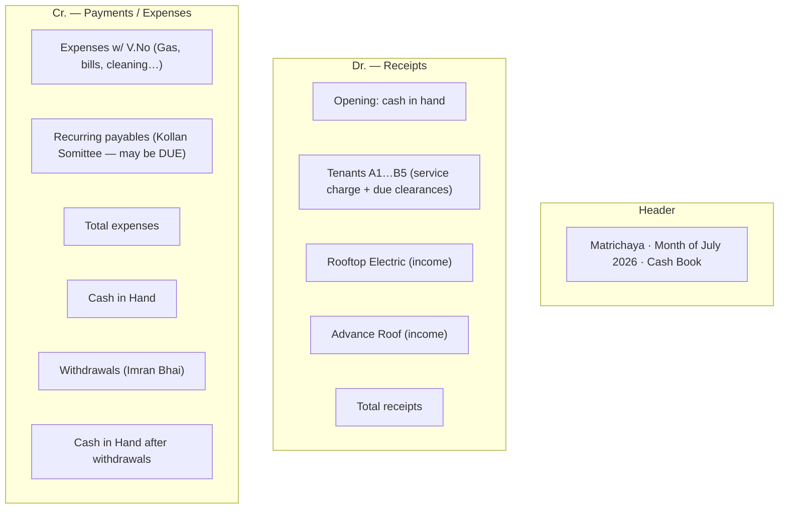

# 08 — Cash Book View

The monthly building dashboard mirrors the real **two-sided cash book**: **Receipts**
(Dr.) on the left, **Payments / Expenses** (Cr.) on the right, with **Total** and
**Cash in Hand** reconciled at the bottom. It is **exportable / printable**.

## Layout



## Columns

**Left — Receipts:** `Date` · `Description` · `V.No` · `Amount` · `Remarks`
**Right — Payments/Expenses:** `Date` · `Description` · `V.No` · `Amount` · `Remarks`

- The **tenant rows are constant** — every current unit (A1…B5) is always listed, even
  if the tenant paid nothing this month (their `Remarks` shows the running due).
- **Extra income** (rooftop rent, rooftop electricity, charity) appears as additional
  receipt lines below the tenants.
- **Expenses** carry an auto **V.No**; unpaid **recurring payables** show as `DUE`.
- **Withdrawals** appear in the reconciliation block, after Cash in Hand.

## Reconciliation block (bottom)

```
Total receipts              = opening + tenant payments + other income
Total expenses (PAID)       = Σ expenses paid
Cash in Hand                = Total receipts − Total expenses
− Withdrawals               = Σ money taken out (e.g. Imran Bhai)
Closing Cash in Hand        = Cash in Hand − Withdrawals   → next month's opening
```

## Real July 2026 mapping

| Cash book element                             | App concept                                            |
| --------------------------------------------- | ------------------------------------------------------ |
| "cash in hand" 11,360                         | `MonthlyPeriod.openingBalance`                         |
| `A1 Mahfuz` … `B5 Faisal` 3,000 each          | tenant `Payment` → `SERVICE_CHARGE` allocation         |
| `B4 Shahadat` 6,000                           | payment: 3,000 service + 3,000 previous-due allocation |
| `Due 27000 / 1000 / 1700` in remarks          | tenant outstanding `Charge`s (`PREVIOUS_DUE`)          |
| `Rooftop Electric` 3,000                      | `Income` `ROOFTOP_ELECTRICITY`                         |
| `Advance Roof` 10,000                         | `Income` `ROOFTOP_RENT`                                |
| Gas / Water / Lift / Beton+Shiri … (V.No 1–7) | `Expense` (PAID) with `voucherNo`                      |
| `Kollan Somittee` "July Due 1400"             | recurring payable → `Expense` `DUE`                    |
| `Cash in Hand` 16,800                         | `Total receipts − expenses paid`                       |
| `Imran Bhai` 16,780                           | `Withdrawal`                                           |
| `Cash in Hand after` 20                       | `MonthlyPeriod.closingBalance`                         |

## Export

- **Print view** styled to match the paper cash book.
- **Export to Excel/PDF** so the output matches the current spreadsheet workflow.
